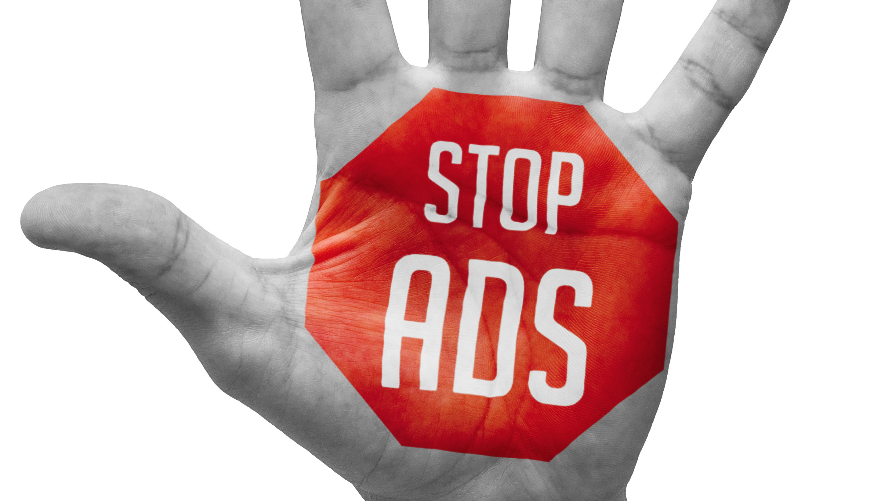
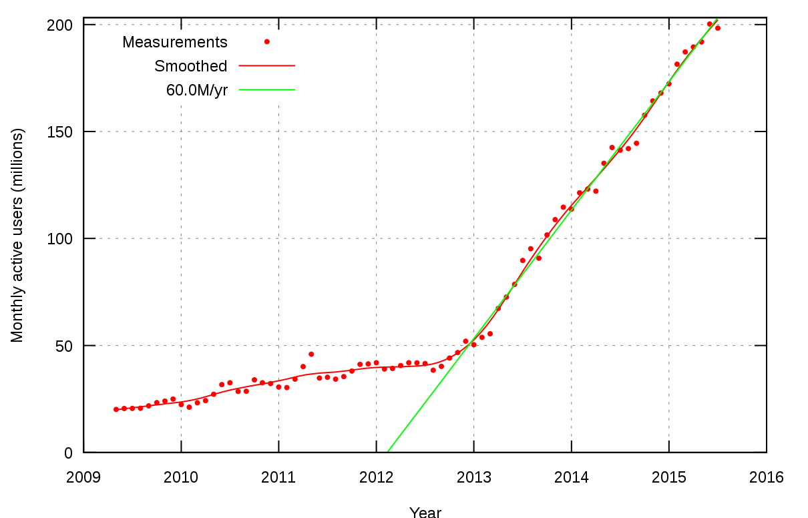
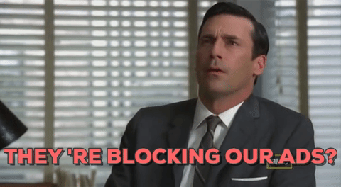
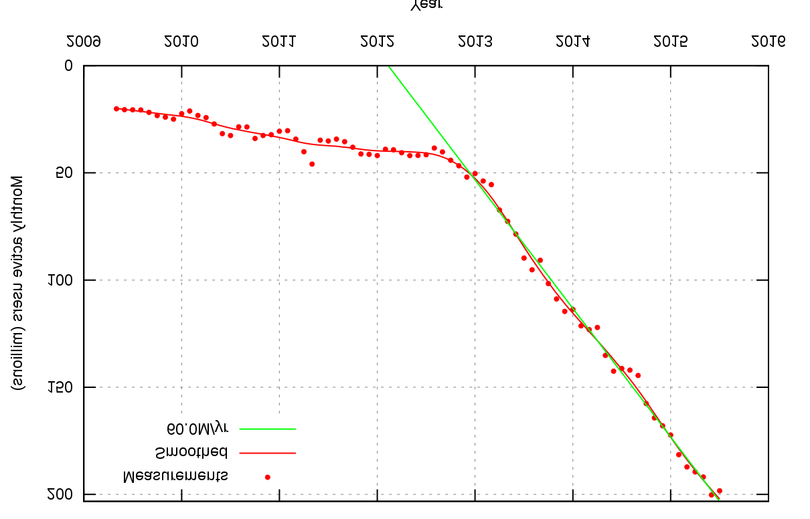
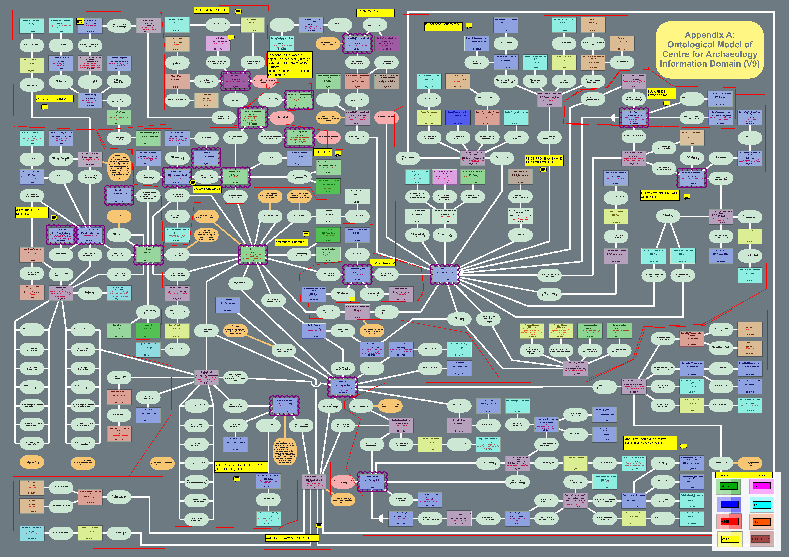

---

layout: ribbon

style: |
    .slide:after {
        display:none;
    }
    .slide > div {
        padding-top: 65px;
    }
    #Cover, #thank-you {
        background-color: black;
        }
    #Cover h2, #thank-you h2 {
        text-align:center;
        margin:150px 0 0;
        color:#a40000;
        font-size:70px;
        }
    #Cover p, #thank-you p {
        margin:10px 0 0;
        text-align:center;
        color:#FFF;
        font-style:italic;
        font-size:20px;
        }
        #Cover p a, #thank-you p a {
            color:#FFF;
    }
    li {
        text-align:center;
        font-size:40px;
    }
    .slide ul li:before {
       display: none;
    }
    #Picture h2 {
        color:#FFF;
        }
    #SeeMore h2 {
        font-size:100px
        }
    img {
        max-width:100%;
        max-height:450px;
        width: 100%;
    }
    li img {
        width: 10%;
        vertical-align: bottom;
    }
    #about-secret-media li {
        text-align: right;
        margin-right: 200px;
    }

---

# The Secret Talk {#Cover}

*[Alex Hoyau](http://lexoyo.me/) CTO @ [Secret Media](http://secretmedia.com)*

<!--

photo by John Carey, fiftyfootshadows.net

{:.note}
Secret => let's play hedgewars for 10 min ;)
-->

<!--

## My Background

* Free software activist

* Social activist

## My Background

* 10 years of freelancing

* Develop in JS, Flash and Haxe

## My Background

* 5 years as a CTO

* Build A teams

* Sell Haxe to clients, investors, boss

-->

## The Big Bad Ads

<!--
http://www.lemonde.fr/
-->

## The Big Bad Ads

## The Big Bad Ads

## The Big Bad Ads

## The Big Bad Ads

<!--
Google (& Mozilla (search bar))
Medias
=> they do not know
-->

## The Kickass Solution

* …unblock ads

* …optimize ads

* …block unacceptable ads

## The Kickass Solution's Problem

* …Flash and JS ads

* …ads loading ads loading ads...

* …...loading JS and Flash code for
  analytics, viewability, fraud detection, tracking

## The Kickass Solution's Problem

## The Kickass Solution's Problem's solutions

* …proxify

* …obfuscate

* …modify

## proxify, obfuscate, modify what?

* …SWF
* …Javascript
* …HTML
* …CSS

## proxify, obfuscate, modify how?

* …modify HTML to intercept the JS and styles

* …modify SWF bytecode

* …modify JS code

## proxify, obfuscate, modify how?

* modify HTML, CSS, JS, SWF

* on the fly

* both on the server side and client side

## YEAH!

## About Secret Media

## About Secret Media - the team

* Alex @lexoyo 

* Clemos @clemenchar 

* Juraj @back2dos 

* JB @JbIPS 

## About Secret Media - the team

* 5 sales persons

## About Secret Media - the team

* 2 founders

## About Secret Media - numbers

* …1 year old company
* …~800K€ per year atm
* …2M hits/min
* …80K lines of Haxe code, JS, Flash, nodejs targets
* …...and the Secret sauce...

## About Secret Media - numbers

* Our clients like Twitch, IGN, JWPlayer, Dailymotion, TF1...

## Next steps

* …[done] unblock video ads
* …unblock display ads
* …optimize or block unacceptable ads
* …big data: play with the cookies we set
* …improve our infrastructure and monitoring tools

## Next steps

* We need brains!
* …We could probably afford you!
* …Apply today!
* …Start training on Hedgewars right away!

## Thank you Merci Obrigado Danke Mersi Спасибо 谢谢 {#thank-you}

